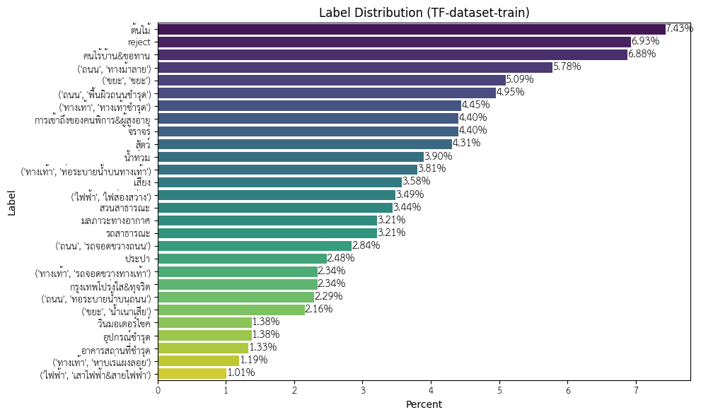
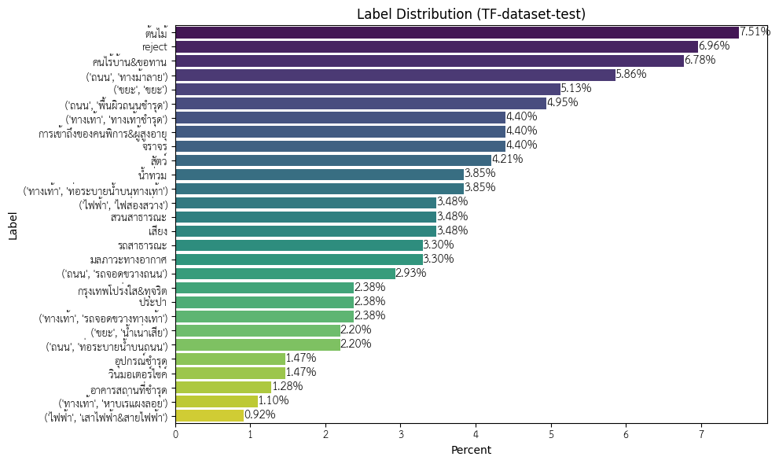

# Traffy-Predict
โครงการพัฒนาระบบปัญญาประดิษฐ์เพื่อจัดประเภทข้อมูลจากแพลตฟอร์ม Traffy Fondue เนื่องมาจากระบบ Traffy Fondue ได้รับข้อมูลการร้องเรียนจากประชาชนทั่วไปจำนวนมาก จึงจำเป็นต้องใช้เวลาจากพนักงานจากหน่วยงานต่าง ๆ จำนวนมากในการแยกประเภทของการร้องเรียน อีกทั้งส่งเรื่องร้องเรียนไปยังหน่วยงานที่เกี่ยวข้องได้อย่างถูกต้อง เพื่อให้ลดเวลาและค่าใช้จ่ายในการประมวลผลเรื่องร้องเรียน จีงมีความจำเป็นในการพัฒนาระบบปัญญาประดิษฐ์ที่สามารถอ่านและทำความเข้าใจเนื้อหา ใจความสำคัญของการร้องเรียน และแยกประเภทปัญหาที่ร้องเรียน รวมถึงส่งเรื่องร้องเรียนไปยังหน่วยงานที่ถูกต้อง

## Dataset
ข้อมูล Label set ใหม่รวบรวมปัญหาข้อร้องเรียนจากประชาชนที่เป็นรูปธรรมและเป็นสิ่งที่ต้องได้รับการแก้ไข ทั้งหมด 19 หัวข้อ และมี 27 labels เมื่อรวม label ย่อยในแต่ละหัวข้อ ได้แก่

1. ทางเท้า: ปัญหาบนพื้นที่ทางเท้า
      - รถจอดขวางทาง
      - หาบเร่แผงลอย
      - ท่อระบายน้ำบนทางเท้า
      - ทางเท้าชำรุด
2. วินมอเตอร์ไซค์: ปัญหาที่เกี่ยวกับวินมอเตอร์ไซค์รับจ้าง
3. ถนน: ปัญหาที่เกิดบนท้องถนน
      - รถจอดขวางทาง
      - ท่อระบายน้ำบนถนน
      - พื้นผิวถนนชำรุด
      - ทางม้าลาย
4. จราจร: ปัญหาการจราจร การสัญจร รถติด ไฟจราจร
5. น้ำท่วม: ปัญหาที่เกี่ยวกับน้ำท่วม
6. ขยะ:สิ่งปฏิกูล ปัญหาที่เกี่ยวกับขยะ
      - ขยะ
      - น้ำเน่าเสีย
7. ไฟฟ้า: ปัญหาที่เกี่ยวกับไฟฟ้า
      - ไฟส่องสว่าง
      - เสาไฟฟ้า&สายไฟฟ้า
8. ต้นไม้: ปัญหาที่เกี่ยวกับต้นไม้
9. สัตว์: ปัญหาที่เกี่ยวกับสัตว์จรจัดหรือสัตว์ที่เป็นอันตราย
10. อุปกรณ์ชำรุด: ปัญหาที่เกี่ยวกับอุปกรณ์สาธารณะที่ชำรุด
11. อาคารสถานที่ชำรุด: ปัญหาที่เกี่ยวกับพื้นที่หรืออาคารชำรุด
12. มลภาวะทางอากาศ: ปัญหาที่เกี่ยวกับมลพิษทางอากาศ เช่น ฝุ่น ควัน กลิ่น
13. ประปา: ปัญหาที่เกี่ยวกับการประปา
14. คนไร้บ้าน&ขอทาน&คนเร่ร่อน: ปัญหาที่เกี่ยวกับคนไร้บ้าน
15. การเข้าถึงของคนพิการ&ผู้สูงอายุ: ปัญหาที่ส่งผลกระทบต่อคนพิการ
16. รถสาธารณะ: ปัญหาเกี่ยวรถสาธารณะ เช่น รถประจำทาง ป้ายรถเมล์ 
17. สวนสาธารณะ: ปัญหาเกี่ยวพื้นที่สวนสาธารณะที่จัดโดยรัฐ
18. เสียง: ปัญหาที่เกี่ยวกับเสียงรบกวน
19. กรุงเทพโปร่งใส&ทุจริต: ปัญหาที่เกี่ยวข้องกับการทุจริต

## Training
ใช้ข้อมูล 2 ชุดในการพัฒนาโมเดล โดยจะมีสัดส่วน Label distribution ดังนี้
1. training set (2180 samples)

2. test set (546 samples)

**ไฮเปอร์พารามิเตอร์** โมเดลถูกพัฒนาโดยการพัฒนาด้วยการ fine-tuning ต่อจากโมเดล PhayaThaiBERT

- Learning Rate = 
- Batch Size =
- Epoch = 

## Performance

| Problem                                   | Precision | Recall | F1-Score | Support |
|-------------------------------------------|-----------|--------|----------|---------|
| ขยะ, ขยะ                                | 0.92      | 0.86   | 0.89     | 28      |
| ขยะ, น้ำเน่าเสีย                          | 0.82      | 0.75   | 0.78     | 12      |
| ถนน, ทางม้าลาย                            | 0.86      | 0.97   | 0.91     | 32      |
| ถนน, ท่อระบายน้ำบนถนน                    | 0.64      | 0.75   | 0.69     | 12      |
| ถนน, พื้นผิวถนนขรุขระ                     | 0.70      | 0.85   | 0.77     | 27      |
| ถนน, รถจอดขวางถนน                        | 0.43      | 0.56   | 0.49     | 16      |
| ทางเท้า, ทางเท้าชำรุด                    | 0.82      | 0.58   | 0.68     | 24      |
| ทางเท้า, ท่อระบายน้ำบนทางเท้า             | 0.78      | 0.86   | 0.82     | 21      |
| ทางเท้า, รถจอดขวางทางเท้า                | 0.86      | 0.92   | 0.89     | 13      |
| ทางเท้า, หาบเร่แผงลอย                     | 0.71      | 0.83   | 0.77     | 6       |
| ไฟฟ้า, เสาไฟฟ้า สายไฟฟ้า                | 0.60      | 0.60   | 0.60     | 5       |
| ไฟฟ้า, ไฟส่องสว่าง                         | 0.85      | 0.89   | 0.87     | 19      |
| reject                                    | 0.91      | 0.79   | 0.85     | 38      |
| กรุงเทพโปร่งใส&ทุจริต                    | 1.00      | 0.77   | 0.87     | 13      |
| การเข้าถึงของคนพิการ&ผู้สูงอายุ           | 0.92      | 0.92   | 0.92     | 24      |
| คนไร้บ้าน&ขอทาน                           | 0.97      | 1.00   | 0.99     | 37      |
| จราจร                                     | 0.59      | 0.54   | 0.57     | 24      |
| ต้นไม้                                    | 0.93      | 1.00   | 0.96     | 41      |
| น้ำท่วม                                    | 0.88      | 0.67   | 0.76     | 21      |
| ประปา                                     | 0.67      | 0.77   | 0.71     | 13      |
| มลภาวะทางอากาศ                             | 0.80      | 0.89   | 0.84     | 18      |
| รถสาธารณะ                                | 1.00      | 0.78   | 0.88     | 18      |
| วินมอเตอร์ไซค์                           | 1.00      | 0.75   | 0.86     | 8       |
| สวนสาธารณะ                               | 0.90      | 0.95   | 0.92     | 19      |
| สัตว์                        | 1.00      | 0.96   | 0.98     | 23      |
| อาคารสถานที่ชำรุด                          | 0.88      | 1.00   | 0.93     | 7       |
| อุปกรณ์ชำรุด                              | 0.88      | 0.88   | 0.88     | 8       |
| เสียง                                      | 0.95      | 0.95   | 0.95     | 19      |

| Metric     | Score | Support |
|------------|-------|---------|
| Accuracy   | 0.84  | 546     |

| Metric           | Precision | Recall | F1-Score | Support |
|------------------|-----------|--------|----------|---------|
| Macro average    | 0.83      | 0.82   | 0.82     | 546     |
| Weighted average | 0.85      | 0.84   | 0.84     | 546     |

## Documents
- การสำรวจข้อมูลและพัฒนา Label set ชุดใหม่
- การพัฒนาโมเดล 
- การสำรวจผลลัพธ์การทำนายของโมเดล 

